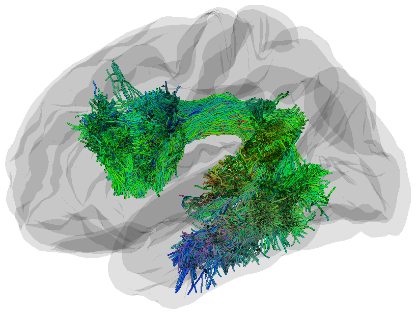
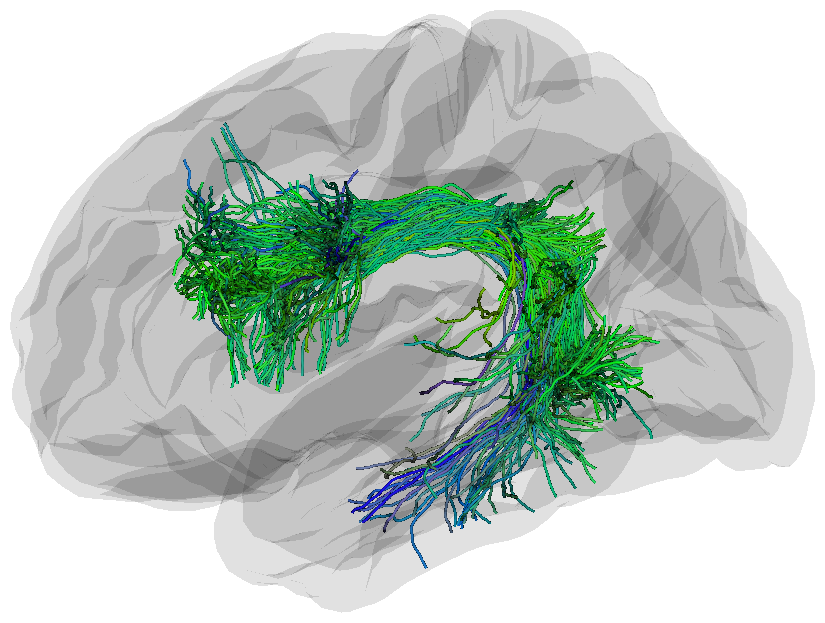
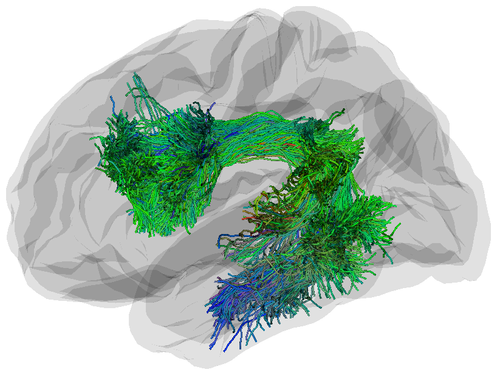

# Streamline Density Normalization (SDNorm)

## Overview
SDNorm ([preprint](https://www.biorxiv.org/content/10.1101/2025.08.18.670965v1)) is a supervised method for reducing bundle variability by normalizing streamline density. We show that SDNorm can 
- Reduce variability in streamline density
- Improve consistency in along-tract microstructure profiles
- Provide useful metrics for automated bundle quality control

## Installation
```
pip install SDNorm
```

## Running SDNorm
To run SDNorm, the input bundle must be in the same space as the template map and they do not need to be in the MNI space. For testing purposes, we provided the template maps of 10 bundles in MNI space (1mm voxel size) used in our paper in `test_data/templates_mni`, and an example AF_L bundle in the same space. We recommend warping template maps to the subject space and running SDNorm there.
```
sdnorm -i test_data/AF_L.trk \
      -temp test_data/templates_mni/AF_L_template_dm.nii.gz \
      -o test_data/sdnorm_outputs/AF_L_sdnorm.trk \
      -ow test_data/sdnorm_outputs/AF_L_sdnorm_weights.txt \
      -oi test_data/sdnorm_outputs/AF_L_sdnorm_indices.txt \
      -or test_data/sdnorm_outputs/AF_L_sdnorm_report.json \
      -lambda 0.001 -espd 8 -step 0.5
```
If you already ran SDNorm, but want to prune bundles with different parameters without refitting the model, you can run
```
sdnorm_prune -i test_data/AF_L.trk \
            -w test_data/sdnorm_outputs/AF_L_sdnorm_weights.txt \
            -temp test_data/templates_mni/AF_L_template_dm.nii.gz \
            -o test_data/sdnorm_outputs/AF_L_sdnorm_2.trk \
            -oi test_data/sdnorm_outputs/AF_L_sdnorm_indices_2.txt \
            -espd 12 -step 0.5

```
but make sure you save the streamline weights when you first run SDNorm!

To create your own template maps, you can create some density maps from extract bundles using `dipy.tracking.utils.density_map`. Then run this command to generate the template map
```
sdnorm_template -i your-folder/sub-*_AF_L.nii.gz \
                -o AF_L_template.nii.gz \
```

<div style="display: flex">
  <div>
    
  </div>
  <figcaption>AF_L before SDNorm</figcaption>
  <div>
    
  </div>
  <figcaption>AF_L after SDNorm with eSPD=8</figcaption>
  <div>
  
  </div>
  <figcaption>AF_L after SDNorm with eSPD=12</figcaption>
</div>


## Cite SDNorm
```
@misc{feng_streamline_2025,
	title = {Streamline {Density} {Normalization}: {A} {Robust} {Approach} to {Mitigate} {Bundle} {Variability} in {Multi}-{Site} {Diffusion} {MRI}},
	copyright = {http://creativecommons.org/licenses/by-nc-nd/4.0/},
	shorttitle = {Streamline {Density} {Normalization}},
	url = {http://biorxiv.org/lookup/doi/10.1101/2025.08.18.670965},
	doi = {10.1101/2025.08.18.670965},
	language = {en},
	urldate = {2025-08-25},
	author = {Feng, Yixue and Shuai, Yuhan and Villalón-Reina, Julio E. and Chandio, Bramsh Q. and Thomopoulos, Sophia I. and Nir, Talia M. and Jahanshad, Neda and Thompson, Paul M.},
	month = aug,
	year = {2025},
}
```